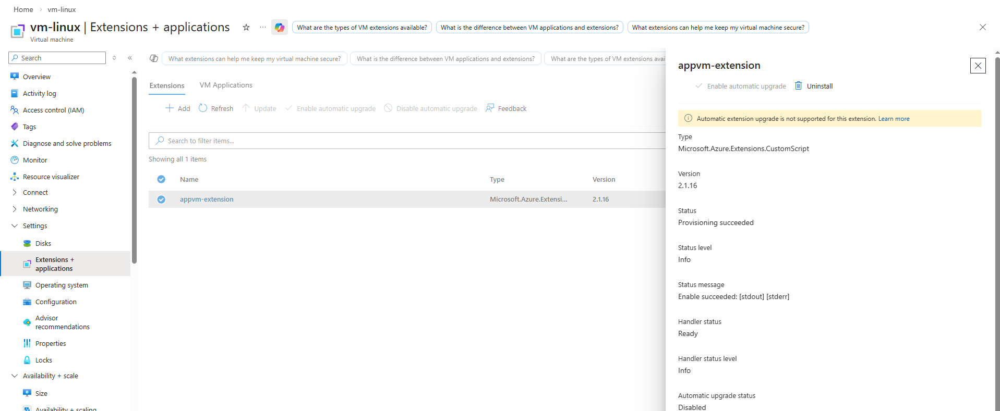
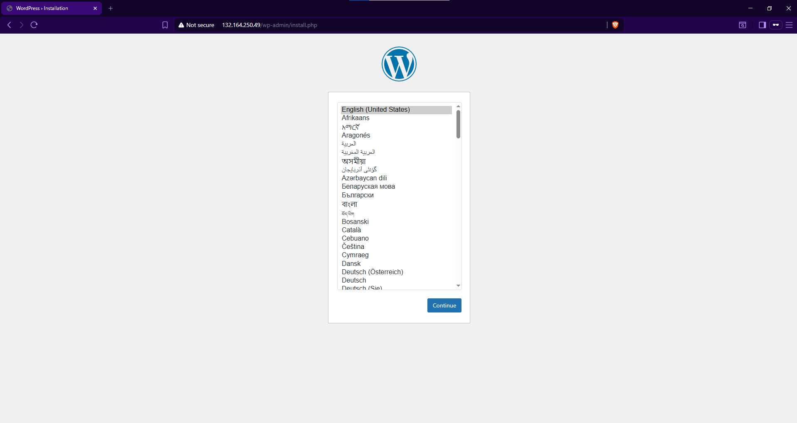
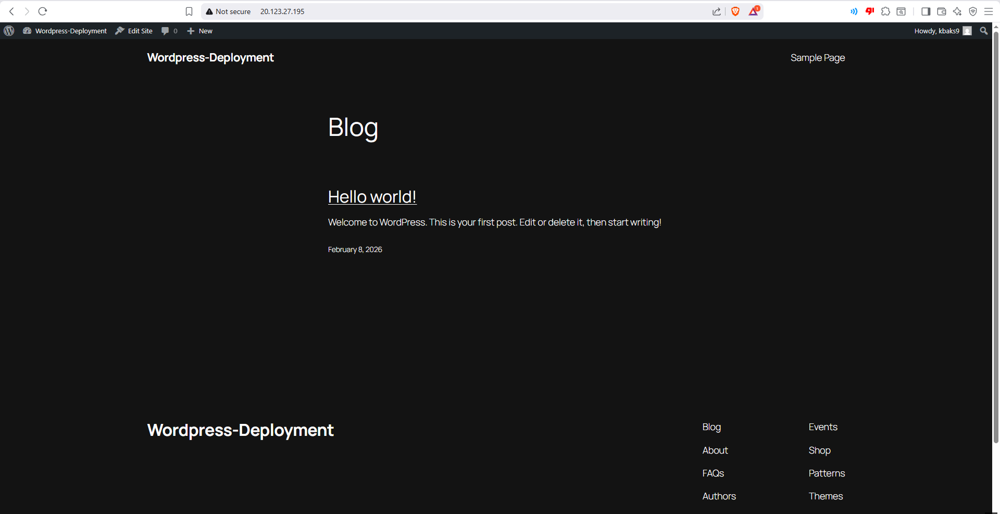
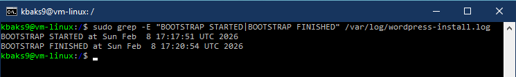

# WordPress Deployment on Azure using Terraform

This project provisions a Linux virtual machine on Azure and deploys a WordPress application using Terraform.  
A startup shell script is executed at first boot (via cloud-init) to install WordPress and all required dependencies automatically.

---

## Architecture Overview

- Azure Linux Virtual Machine
- Network Security Group allowing SSH & HTTP access
- Startup shell script executed at VM boot time to install WordPress and dependencies
- Infrastructure provisioned using Terraform

---

## Project Structure

```text
.
├── main.tf
├── variables.tf
├── outputs.tf
├── terraform.tfvars
├── .gitignore
├── modules/
│   ├── compute/
│   │   ├── main.tf
│   │   ├── variables.tf
│   │   └── outputs.tf
│   ├── network/
│   │   ├── main.tf
│   │   ├── variables.tf
│   │   └── outputs.tf
│   └── security/
│       ├── main.tf
│       ├── variables.tf
│       └── outputs.tf
├── script/
│   └── wordpress.sh
├── images/
│    ├── custom-script-extension-succeeded.png
│    ├── wordpress-running.png
│    ├── wordpress-installation.png
│    └── bootstrap-log.png
└── README.md

---

## 🛠️ Prerequisites

- Terraform >= 1.5
- Azure CLI authenticated (`az login`)
- An active Azure subscription

---

## Configuration

Sensitive values are **not committed** to source control.

Create a file called `terraform.tfvars` in the project root and populate the required variables defined in `variables.tf`.

Example (but you'd require more variables):
```hcl
subscription_id = "xxxxxxxx-xxxx-xxxx-xxxx-xxxxxxxxxxxx"
admin_username  = "azureuser"
admin_password  = "strong-password"
```
Also within `script/wordpress.sh` you can change the database new, user, and pass to what you like.

---

## Deployment

1. Clone the repository
2. Create `terraform.tfvars` with the required values
3. Change database name, user, pass in: `script/wordpress.sh`
3. Initialise Terraform:
   ```bash
   terraform init
   ```
4. Create an execution plan:
   ```bash
   terraform plan -out main.tfplan
   ```
5. Apply the plan:
   ```bash
   terraform apply main.tfplan
   ```
6. Copy the output public IP address into a url to access installation page.

---

## Deployment Evidence

The following screenshots demonstrate successful provisioning, automated first-boot configuration, and application availability.

**Azure Custom Script Extension – Successful Execution**  


**WordPress Application Installation Page via Public IP**


**WordPress Application Accessible via Public IP**  


**First-Boot Automation Log Output**  


---

## Access

Once deployment completes, you can SSH into the virtual machine using the admin credentials defined in `terraform.tfvars`.

If a public IP output is available:
```bash
ssh admin_username@<public-ip>
```

---
